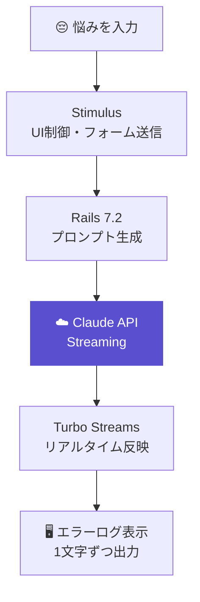

<div align="center">

# ErrorLog AI

<p>悩みを、AIがエラーログへ変換する。<br><b>笑えるけど、少し救われる。</b></p>

<br>


<br>

> [!NOTE]
> 🚧 **開発予定プロジェクトです。** 現在は設計・技術選定を進めています。

</div>

---

## 概要

仕事、恋愛、人間関係、お金──

誰もが抱える悩みを、AIがプログラムのエラーログ形式へ変換します。
笑って終わるだけではなく、最後には少し前向きになれる「Suggested Fix」を返します。

```
入力：「彼氏から返信が来ない」

──────────────────────────────────────
[ERROR] ConnectionTimeout
恋人との通信が確立できません

  at Relationship.waitForReply (heart.rb:42)
  at Life.checkNotifications (life.rb:108)

再試行回数    : 47
最終通信      : 3時間前
エラーレベル  : 🟠 ERROR

Suggested Fix:
  → 今日は十分頑張りました。
  → このエラーは永続化されません。
  → 一晩おいて再試行してください。
──────────────────────────────────────
```

---

## Architecture

> 悩みを受け取り、Claude API がストリーミングでエラーログを生成。Turbo Streams がリアルタイムで1文字ずつDOMに反映します。



---

## 機能

| 機能 | 内容 |
|---|---|
| **AIエラーログ生成** | Claude API によるリアルタイムストリーミング出力 |
| **エラーレベル自動判定** | INFO / WARNING / ERROR / CRITICAL / FATAL をAIが決定 |
| **レア演出** | 低確率で `✨ NO BUG DETECTED` が出現 |
| **Markdownコピー** | GitHub・Discord へそのまま貼り付け可能 |
| **画像として保存** | エラーログをSNS向け画像に変換 |
| **履歴** | 過去のエラーログを保存・見返せる |
| **公開オプション** | 結果を匿名で公開可能（デフォルトは非公開） |
| **みんなのログ** | 公開されたログの一覧、笑った・共感ランキング |
| **利用回数制限** | 未ログイン 5回/日、ログイン 20回/日 |

---

## 技術スタック

| カテゴリ | 技術 | 用途 |
|---|---|---|
| **Backend** | Ruby 3.2 / Rails 7.2 | API・Webアプリ基盤 |
| **AI** | Claude API (Streaming) | エラーログ生成・エラーレベル判定 |
| **Frontend** | Turbo Streams | ストリーミングレスポンスのリアルタイムDOM反映 |
| | Stimulus | UI制御・インタラクション |
| **Database** | PostgreSQL | ユーザー・ログデータの保存 |
| **Infra** | Docker / Docker Compose | 開発環境の再現 |
| | Render | デプロイ |
| **Other** | 動的OGP生成 | Xシェア時にエラーログを画像で表示 |

---

## Roadmap

- [x] コンセプト設計
- [x] 技術選定・アーキテクチャ設計
- [ ] UIデザイン完成
- [ ] MVP開発（入力 → 出力の基本フロー）
- [ ] Claude API ストリーミング実装
- [ ] Turbo Streams によるリアルタイム表示
- [ ] 動的OGP生成
- [ ] βリリース

---

## Why?

「悩みをなくすことはできない。でも、少し笑える形に変えられるかもしれない。」

ErrorLog AI は、AIを使って"悩みの見え方"を変えることを目指したプロジェクトです。

---

<div align="center">
  <sub>Built with Ruby on Rails & Claude API</sub><br>
  <sub>Designed &amp; Developed by <a href="https://github.com/mize1978">mize1978</a></sub>
</div>
